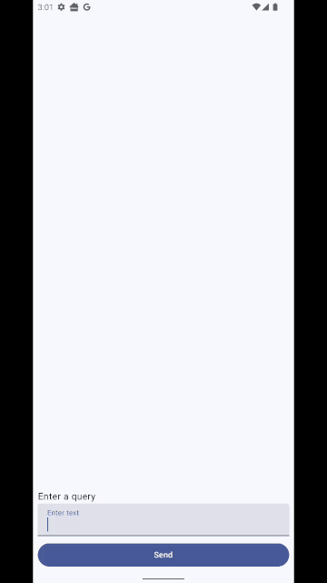

# Minimal Gemma 3 example



This example shows "ask a question get an answer" for its demo.
But Gemma3 is so much more than that, and you would typically get responses "behind the scenes" rather than use it as a chatbot. (And such
the latency in this gif (of an emulator) becomes more irrelevant.)

For a full fledged example see:

- https://ai.google.dev/edge/mediapipe/solutions/genai/llm_inference/android
- https://github.com/google-ai-edge/mediapipe-samples/blob/main/examples/llm_inference/android

As well as writing the code, you need to get a token from hugging face for downloading the Gemma 3 Model (or any model)

- Get a token: https://huggingface.co/settings/tokens
- Download url: https://huggingface.co/litert-community/Gemma3-1B-IT/resolve/main/gemma3-1b-it-int4.task?download=true

This app expects you to have `huggingface.token = 1234abcd` in your root `local.properties` file.

You may encounter an error like this if using an old version of MediaPipe:

```
// tflite com.blundell.tut.gemma3  E  Didn't find op for builtin opcode 'STABLEHLO_COMPOSITE' version '1'. 
An older version of this builtin might be supported. 
Are you using an old TFLite binary with a newer model?
```

It means your `implementation("com.google.mediapipe:tasks-genai:0.10.22")` is out of date.
